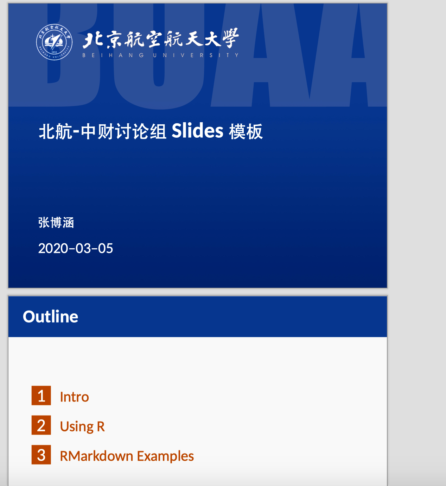

# KL Lab Templates

## install

```R
library("devtools")
install_github("AngelPone/KLLabTemplates")
```


## Slides

Usage Sample:

```R
---
title: 北航-中财讨论组 Slides 模板
author: 张博涵
date: \today
classoption: compress
CJKmainfont: STHeitiSC-Medium # 若包含中文必须设置
toc: true
output: 
  KLLabTemplates::slides: # package 中的函数
    latex_engine: "xelatex" # 若包含中文必须设置
    school: "cufe" # school 可选择 cufe 以及 buaa
---
```


Buaa sample：




Cufe Sample ：


Forked from [robjhyndman/MonashEBSTemplates](https://github.com/robjhyndman/MonashEBSTemplates)

